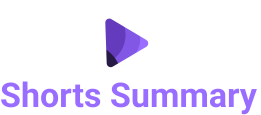
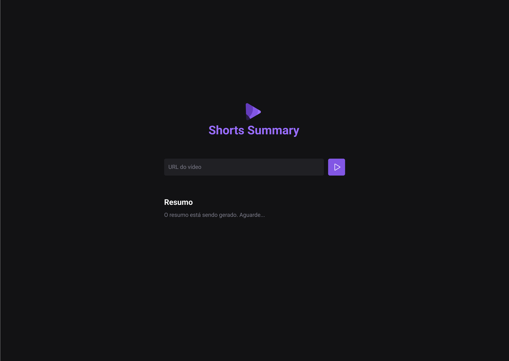

<p align="center">
  
</p>

<p align="center">
  
</p>

## 📒 Descrição

Shorts Summary é uma aplicação web para criar resumo de vídeos shorts do Youtube utilizando Inteligência Artificial para transcrever o conteúdo do vídeo e realizar o resumo do conteúdo. Esse projeto é desenvolvido na trilha Foundations na edição NLW IA.

## 📚 Funcionalidades

- [x] Cria resumo de vídeos shorts do YouTube utilizando Inteligência Artificial para transcrever o conteúdo do vídeo e realizar o resumo do conteúdo

## 🔧 Tecnologias utilizadas

- Front-end:

  - HTMl
  - CSS
  - Javascript
  - Axios

- Back-end:
  - Node.js
  - Express
  - Cors
  - Ffmpeg Static
  - Fluent Ffmpeg
  - Node Wav
  - YTDL Core
  - Xenova/Transformers

## 💻 Pré-requisitos

Antes de começar, verifique se você atendeu aos seguintes requisitos:

- Você tem uma máquina `<Windows / Linux / Mac>`
- Node.js instalado. Você pode instalar o Node através [DESSE LINK](https://nodejs.org/en)

## 🚀 Como Executar o Projeto

```bash
# clone o repositório
$ git clone https://github.com/eupedrohenrique/app-shorts-summary.git

# Instale as dependências
$ npm install

# Execute o servidor
$ npm run server

# Execute o front
$ npm run web
```

- O servidor back-end estará sendo executado em http://localhost:3333.
- O aplicação front-end estará sendo executado em http://localhost:5173.

## 🤝 Criador

<table>
  <tr>
    <td align="center">
      <a href="#">
        <br>
        <sub>
          <b>Pedro Henrique</b>
        </sub>
      </a>
    </td>
  </tr>
</table>

## 🎯 Status do projeto

O projeto está finalizado.

## :memo: Licença

Esse projeto está sob a licença MIT. Veja o arquivo [LICENSE](https://github.com/eupedrohenrique/app-shorts-summary/blob/main/LICENSE) para mais detalhes.
